# Importing and Exporting Tasks

## What is it?

Export and import move your work from one machine to another — when you set up a new computer, when you move to a replacement machine, or when a colleague needs a task you have already built.

**Export** saves the tasks you select, and any user variables you select, into a single `.zip` file. **Import** reads that file on another machine and adds the tasks there.

The **Export Settings** and **Import Settings** buttons are on the RPA Tray Client dashboard.

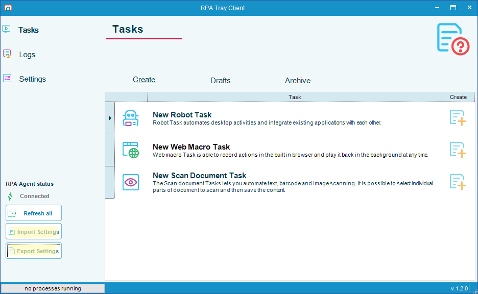

:::note Variables are selected separately from tasks
RPA does not work out which variables a task depends on. Tasks and user variables are two independent lists in the **Export Settings** window. If your tasks use user variables, select those variables yourself or they will not be in the file.
:::

## Before you start

- The machine you import on must be running the same version of OpCon RPA as the machine you exported from, or a newer one. The file records the version of the file format it was written in, and import refuses a file written in a format newer than the importing Tray Client understands
- Credentials are never included in the exported file. The file records only which Windows user each task runs as, and you supply the password again on the destination machine — see [Supply the credentials an imported task needs](#supply-the-credentials-an-imported-task-needs)
- To open a password-protected export outside RPA, you need [7-Zip](https://www.7-zip.org/). Inside the **Import Settings** window you only enter the password — no additional software is required

## Export tasks

### 1. Select what to export

To choose the tasks and variables to export, complete the following steps:

1. On the RPA Tray Client dashboard, select the **Export Settings** button. The **Export Settings** window is displayed.

   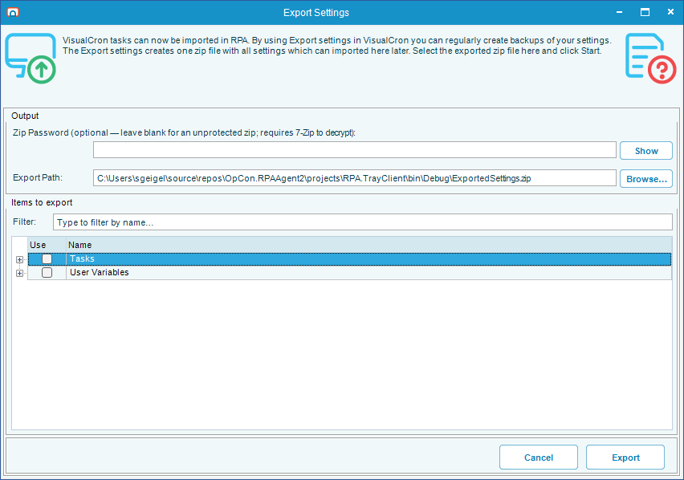

2. Under **Items to export**, select the option in the **Use** column beside each item you want to include. Selecting a category includes everything in it, and selecting a task name includes all of that task's versions.

    | Category | What it contains |
    |---|---|
    | **Tasks** | Your recordings, organized by name and version. Each task can have several versions, including drafts. A draft is a task you have started building but not finalized — it is saved, but it does not have to be complete. Draft versions are listed as `draft` rather than with a version number |
    | **User Variables** | The values you have defined for use inside your tasks, such as a folder path or a user name |

3. (Optional) Expand a task and select individual versions instead of all of them.

   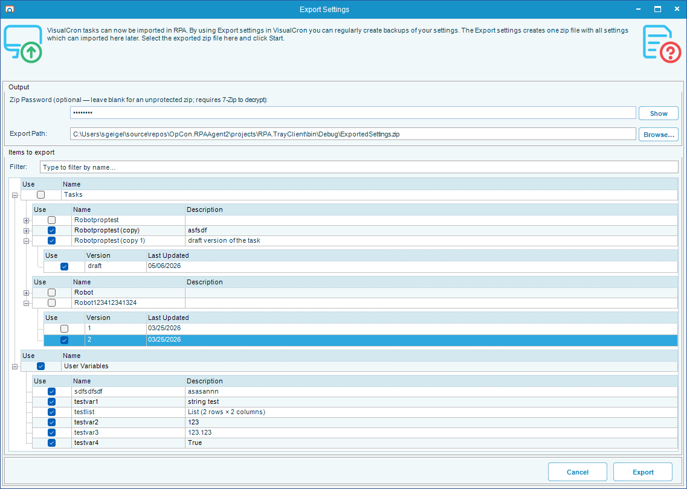

### 2. (Optional) Set a password

If your tasks or variables contain anything sensitive, protect the file with a password.

:::warning There is no way to recover a forgotten password
Record the password somewhere safe before you continue. Without it the file cannot be opened.
:::

To protect the exported file, enter a password in the **Zip Password (optional — leave blank for an unprotected zip; requires 7-Zip to decrypt)** field. The password is hidden as you enter it — press and hold the **Show** button to check what you entered.

If you leave the password blank, anyone who has the file can read it, including your user variable values and the user name and domain each task is set to run as.

### 3. Choose where to save the file

To set the destination, complete the following steps:

1. Select the **Browse…** button beside the **Export Path:** field and choose a location, or enter a path in the field directly.
2. Confirm the path resolves the way you expect. The exported file is always a `.zip` file:

    | What you enter | Result |
    |---|---|
    | A path with no extension | RPA adds `.zip` |
    | A path with any other extension | RPA refuses it and reports `Invalid file extension. Only .zip files are allowed.` Correct the extension and try again |
    | The path of an existing folder | RPA saves `ExportedSettings.zip` inside that folder |

   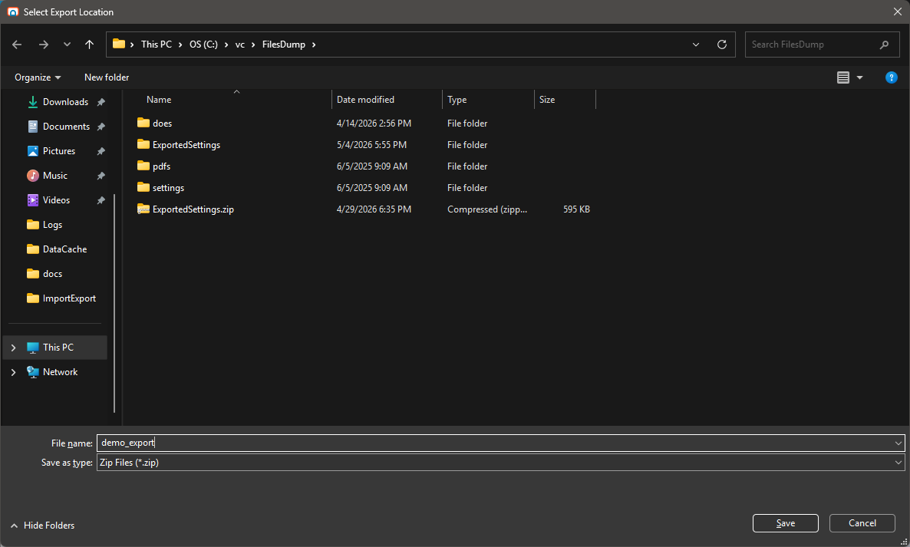

### 4. Export the file

To create the file, select the **Export** button. If a file of that name already exists, RPA asks you to confirm the overwrite. A confirmation message is displayed when the export finishes.

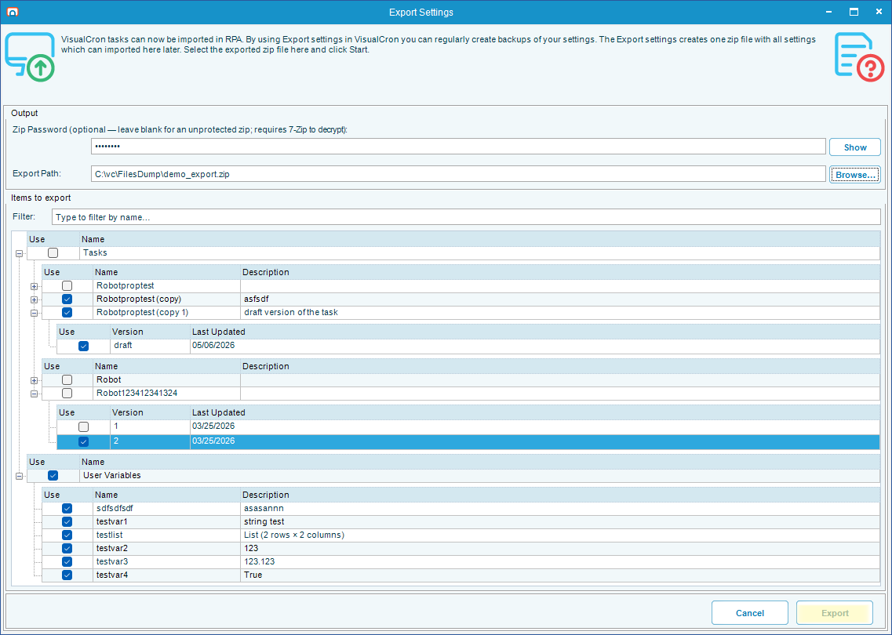

The file is now ready to copy to another machine, by email, USB drive, network share, or whatever method you normally use.

## Import tasks

To import an exported file, complete the following steps:

1. On the destination machine, select the **Import Settings** button on the RPA Tray Client dashboard. The **Import Settings** window is displayed.

   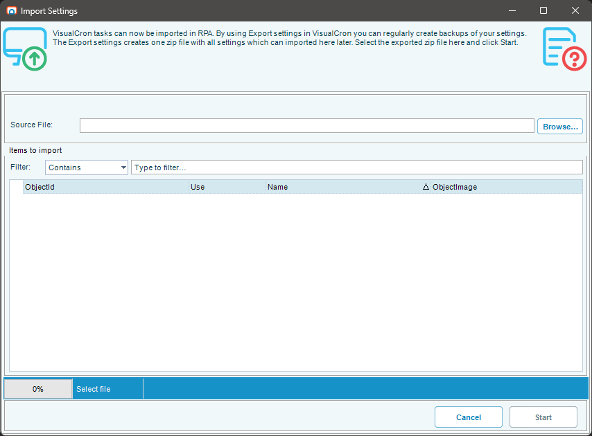

2. Select the **Browse…** button and select the `.zip` file you exported.
3. If the file is password-protected, enter the password when RPA asks for it. The contents are not listed until the password is accepted.

   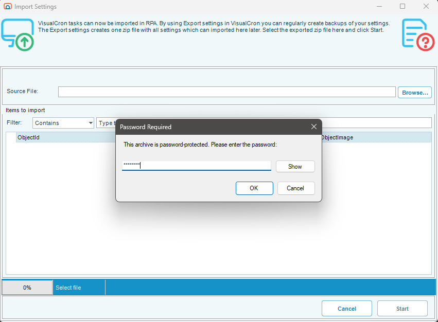

4. Under **Items to import**, select the option in the **Use** column beside each item you want to bring in. The file's contents are grouped into two categories, **RPA Tasks** and **RPA Variables**. You do not have to import everything in the file.

   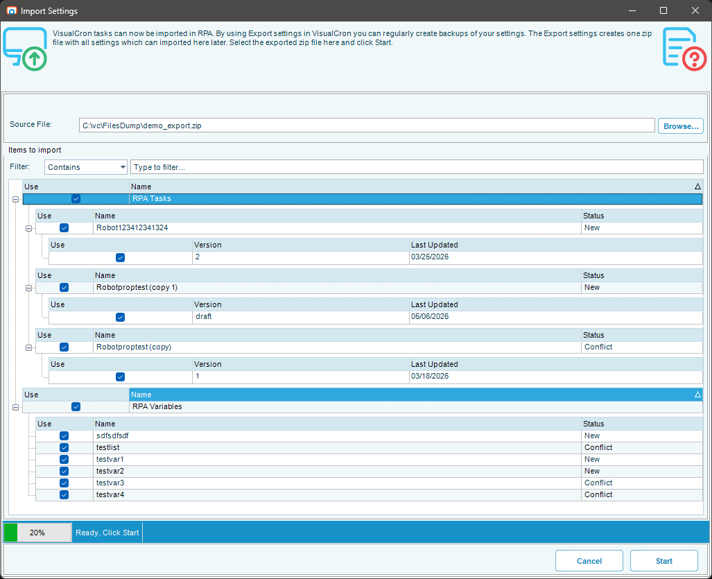

5. Select the **Start** button. A confirmation message is displayed when the import finishes, and the imported tasks appear on the dashboard.

   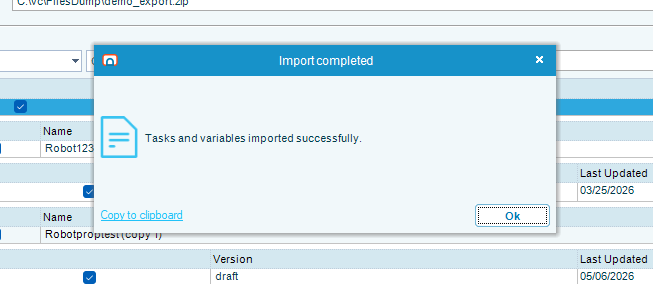

Most imports run straight through. If the file needs a decision from you, RPA asks before continuing — either to resolve a name conflict or to supply a credential, both described below.

## Resolve a name conflict

If a task you are importing already exists on this machine under the same name, RPA does not overwrite it without asking. The **Resolve Import Conflict** window is displayed once for each conflicting task, so you can make a different choice for each one.

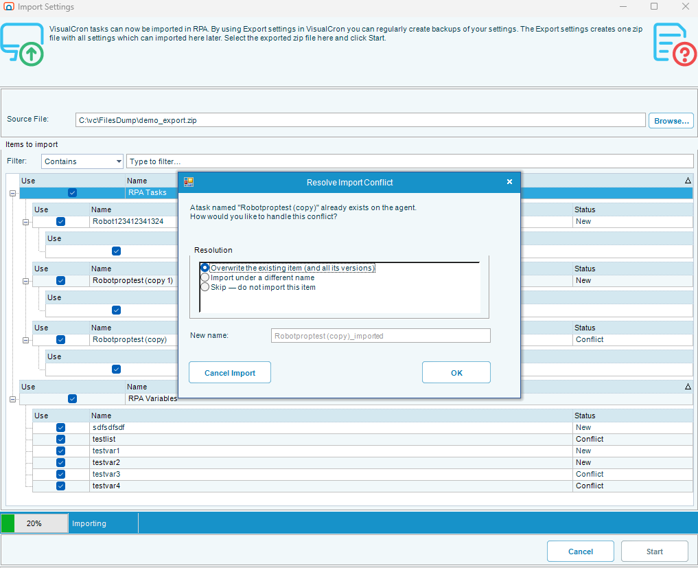

Select one of the following options:

| Option | Result |
|---|---|
| **Overwrite the existing item (and all its versions)** | Replaces the task on this machine along with every version of it. Use this only when you are certain you do not need any of the existing versions |
| **Import under a different name** | Keeps the existing task untouched and imports the incoming one under a new name. RPA suggests a default in the **New name** field, such as `MyTask_imported`. Change it to whatever you want |
| **Skip — do not import this item** | Leaves the existing task alone and does not import the incoming one |

## Supply the credentials an imported task needs

A credential is a saved user name and password that a task uses to sign in as a particular Windows user when it runs. Credentials are deliberately never exported — the file records only *which* user the task was set to run as, and you supply the password again on the destination machine.

When you import a task that runs as a specific user, RPA checks whether that user is already saved on this machine. If not, the **Missing Credentials** window is displayed, naming the tasks that need the credential and the user the original machine was set to use.

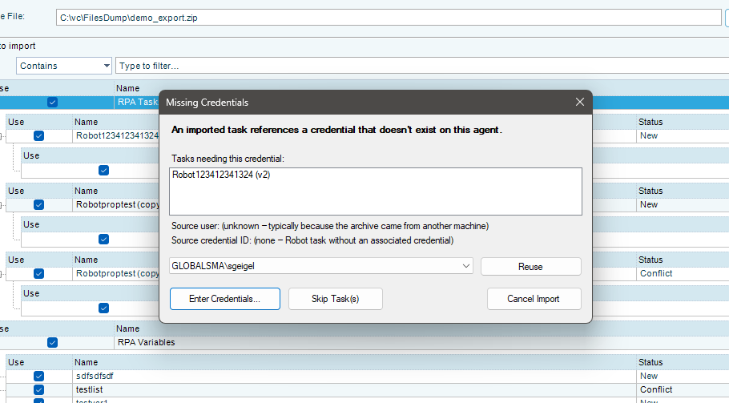

Select one of the following options:

| Option | Result |
|---|---|
| **Enter Credentials...** | Enter the password for the user shown. RPA validates the password immediately, then saves the credential and uses it for the task. If the file does not include the original user name and domain — which can happen with files from older versions — you can enter those as well |
| **Reuse** | Select an existing credential from the list instead of entering the password again. Available when you have already entered a password for this user earlier in the same import, or when the user is already saved on this machine. This is the quickest option when several tasks all run as the same user |
| **Skip Task(s)** | Does not import the listed tasks. The rest of the import continues. You can sign in as the correct user later and import again |
| **Cancel Import** | Stops the whole import. Nothing is added to this machine |

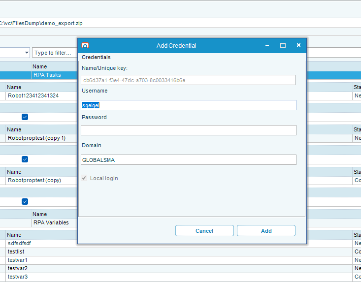

:::note Drafts do not need a credential
A draft is an unfinished task, and a credential is only required when you finalize a task. RPA does not ask for credentials when you import a draft that has none. You can finish the draft and assign a credential later.
:::

## FAQs

**Are passwords included in the exported file?**
No. Only the user name, the domain, and the credential's identifier are recorded. Passwords stay on the original machine, and you enter them again on the destination machine during import. This is deliberate.

**What if the same user does not exist on the destination machine?**
The **Missing Credentials** window is displayed. Enter that user's credentials, select an existing credential with **Reuse**, or skip the task. See [Supply the credentials an imported task needs](#supply-the-credentials-an-imported-task-needs).

**Can I import the same file more than once?**
Yes. If the tasks already exist, the **Resolve Import Conflict** window is displayed for each one.

**Why do I need 7-Zip to open a password-protected file outside RPA?**
The exported file uses a stronger form of password protection than the one built into Windows File Explorer. 7-Zip is a free utility that understands the format. You do not need it to import the file in RPA — enter the password when RPA asks for it.

**Can I edit the exported file?**
No. The file format is internal to RPA, and editing it can break the import. Change the original tasks and export again.

**The exported file was not saved where I expected.**
Enter a full path, such as `C:\Users\me\Desktop\mytasks.zip`, or use the **Browse…** button. If you enter only a folder, RPA saves the file in that folder as `ExportedSettings.zip`.

**Can I export a task from a newer version and import it on an older one?**
No. Import refuses a file written in a format newer than the importing Tray Client understands. Import on the same version or a newer one.

## Related topics

- [Copy a Task](./copy-task-rpa.md)
- [Delete a Task](./delete-task-rpa.md)
- [Back Up and Restore the Database](./rpa-backup-restore.md)
- [Task Types](./task-types-overview.md)

## Glossary

| Term | Definition |
|------|-----------|
| Export | Saving selected OpCon RPA tasks and user variables into a single `.zip` file for use on another machine. |
| Import | Reading an exported file on another machine and adding its tasks and user variables there. |
| Draft | An unfinished task version. Drafts are saved but do not have to be complete, and they do not require a credential. |
| User variable | A value defined in the RPA Tray Client for use inside tasks, such as a folder path or a user name. |
| Credential | A saved Windows user name and password that a task uses to sign in as that user when it runs. Never included in an exported file. |
