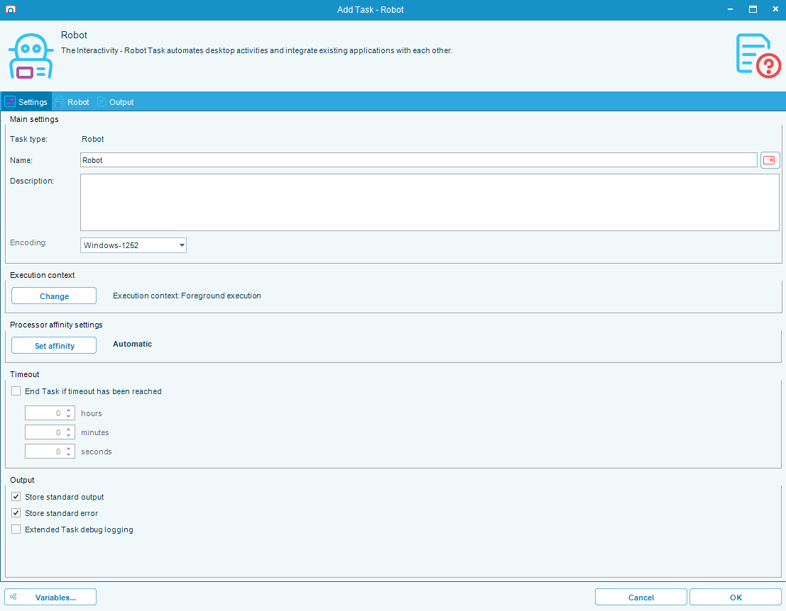
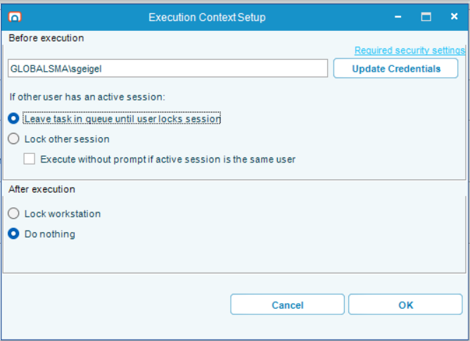
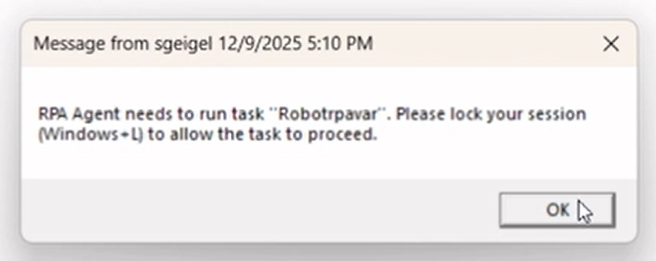
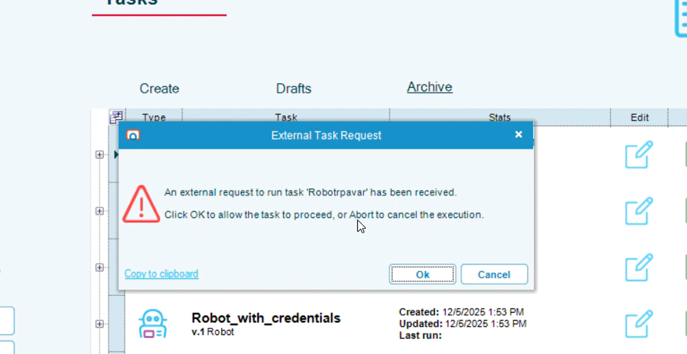
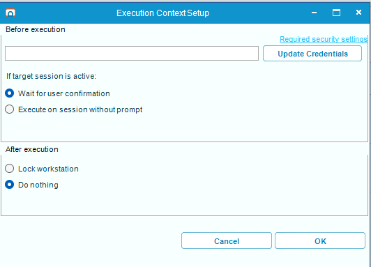
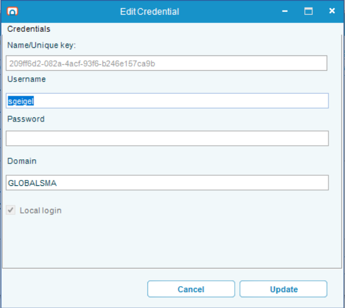

# Robot Tasks

Robot Tasks interact with Microsoft Windows on behalf of the user. They can be created by a combination of
recording actions the user performs on their desktop and dragging and dropping individual activities to the workflow.

## Quick Reference

### Common Scenarios

**I want RPA to run automatically without any popups:**
- **Single User Machines:** Select "Lock other session"
- **Multi-User Machines:** Select "Execute on session without prompt"

**I want to approve each task before it runs:**
- **Single User Machines:** Select "Leave task in queue until user locks session"
- **Multi-User Machines:** Select "Wait for user confirmation"

**I want the session to remain unlocked after the task completes:**
- Select "Do nothing" under After Execution Behaviors

### Machine Type Quick Check

| Machine Type | Examples | Key Difference |
|--------------|----------|----------------|
| **Single User** | Windows 10, Windows 11 | Only one user can control the desktop at a time |
| **Multi-User** | Windows Server 2016/2019/2022 | Multiple users can have active desktop sessions simultaneously |

## Execution Context
The execution context can be found on the main form with the button named _Execution Context_. This will set up the rules
of how your task will interact with the machine before and after it runs. The Execution Context is set to the user that is
currently logged in and editing the task.

:::tip Note
When another user edits this task, your Execution Context settings will remain unchanged unless they specifically open the Execution Context menu.
Also, while an Execution Context is required for an RPA task, this is only at the _Publish_ stage. _Drafts_
can be saved without an Execution Context.
:::

:::warning IMPORTANT: RPA Cannot Log You In After Reboot
RPA can unlock locked sessions, but it **cannot log in for you**. After a machine reboot, you must manually log in as each user and then lock their sessions.

**Example:** If you have tasks running as UserA and UserB:
1. After reboot, log in as UserA
2. Press Win+L to lock the session
3. Log in as UserB
4. Press Win+L to lock the session
5. Now RPA can execute tasks for both users
:::

### Single User Machines
For Single User Machines (i.e., Windows Desktop editions), there can only be one user in control of the machine at a time.

#### Before Execution Behaviors

In the screenshot, a user has already been selected. To assign your user to the task, click either "Update Credentials" or "Add Credentials".

__Leave task in queue until user locks session__

When RPA receives a command to execute this task, it will display a warning dialog to the currently logged-in user. The task will not run until the user locks their session (either by clicking OK on the dialog or pressing Win+L).

This setting can slow down automation, but is useful for testing or when combined with _Execute without prompt if active session is same user_.

**If a different user is logged in:**

RPA will display this warning. The user can dismiss the message, but execution will wait until the user locks their session.

**If the same user is logged in:**
RPA will display this warning instead. This gives the user the opportunity to abort the task. If the user clicks OK, the task will begin executing.

__Execute without prompt if active session is same user__

This checkbox is only enabled when _Leave task in queue until user locks session_ is selected.
When enabled, if the Execution Context user matches the currently logged-in user, RPA will skip the warning dialog and execute immediately.

__Lock other session__

When selected, RPA will automatically lock the active session if it belongs to a different user than the Execution Context user.
If the active session already belongs to the Execution Context user, RPA will proceed directly to execution.

#### After Execution Behaviors
__Lock Workstation__

This is the more secure option that locks the current user (equivalent of Win+L) after the task has completed.

__Do nothing__

This will leave the executing user's session unlocked. This is useful if you are chaining multiple RPA tasks
under the same user to prevent delays caused by repeatedly locking and unlocking sessions.

### Multi-User Machines
For Multi-User Machines (i.e., Windows Server editions), there can be several active desktop sessions at a time.
Since multiple users can be logged in simultaneously, session switching is not needed. However, locking sessions remains important for security.

**Note:** When RPA locks a session, it does not terminate RDP connections. If the user was logged in through RDP, the connection remains active, but the session will show a lock screen.

#### Before Execution Behaviors

In the screenshot, a user has already been selected. To assign your user to the task, click either "Update Credentials" or "Add Credentials".

Before the task executes, the session will be unlocked (if it was locked).

__Wait for user confirmation__

When RPA receives a command to execute this task, it will display a warning dialog to the user. The task will not run until the user clicks OK.

This gives the user the opportunity to abort the task. If the user clicks OK, the task will begin executing.

This setting can slow down automation but is useful for testing.

__Execute on session without prompt__

When selected, RPA will automatically execute on the user's session without displaying any warnings or confirmation dialogs.

#### After Execution Behaviors
__Lock Workstation__

This is the more secure option that locks the current user (equivalent of Win+L) after the task has completed.

__Do nothing__

This will leave the executing user's session unlocked. This is useful if you are chaining multiple RPA tasks
under the same user to prevent delays caused by repeatedly locking and unlocking sessions.

## Credentials

The edit credentials screen shows information from your current Windows session.

All fields are read-only and automatically filled from your session.

### First-Time Setup

If this is the first time setting up your user for RPA execution:
1. You will need to type in your password
2. Click to confirm the dialog
3. RPA will verify your password is correct for this user account

### How Your Credentials Are Protected

Your credentials are secured through multiple layers:

1. **Secure Transmission:** Your credentials are sent over HTTPS to the RPAAgent service on localhost (this connection also uses your Windows session for authentication)
2. **Encryption:** Your username and password are encrypted using a randomly generated key that was created when you first started RPA
3. **One-Time Entry:** After the initial setup, you will not need to enter your password again when creating additional Execution Contexts

### How Credentials Are Used During Execution

- Your credentials are never stored in plain text
- The system references you only by your GUID (a unique identifier)
- Your encrypted credentials are never decrypted and sent back to you, and cannot be read by the Tray Client
- When the Agent service receives a command to execute a task, it will:
  1. Look up the GUID for the task
  2. Decrypt the credentials
  3. Switch to the appropriate user session
  4. Promptly discard the decrypted credentials from memory
