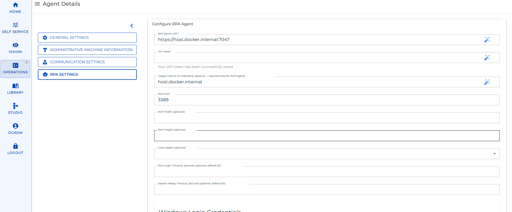
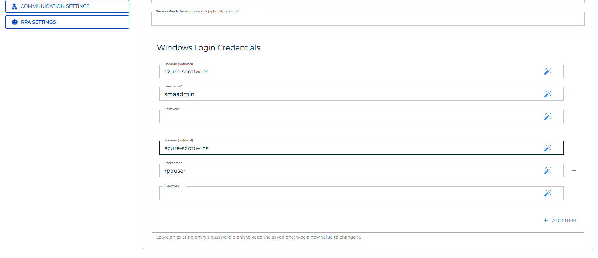

# RDP Login

## What is it?

A Robot Task drives an interactive Windows desktop, so it needs a signed-in session to run in. Without RDP login, someone has to sign in on the RPA host first, and RPA can only unlock a session that already exists.

RDP login removes that requirement. Before starting a Robot Task, OpCon opens a Remote Desktop connection to the RPA host and signs in as a Windows account you configured. That creates the interactive session the Robot Task needs, with no one at the machine.

The connection is opened by the OpCon RPA integration, not by the RPA Agent service. The Agent still runs the task exactly as it does for a session a person signed in to.

:::note Robot Tasks only
Only Robot Tasks offer an RDP login user, because only a Robot Task drives the Windows desktop directly. The field does not appear on Web Macro or Scan Document tasks.
:::

:::tip RDP login is one part of unattended operation
Signing the account in is what creates the session. Ending it afterwards is the other part. For the setup from end to end, see [Unattended Session](./rpa-unattended-session.md).
:::

## How a task run decides whether to sign in

Each time OpCon starts a Robot Task, the integration asks the RPA Agent whether the task's execution user already has a usable session, then acts on the answer.

| Agent reports | What the integration does |
|---|---|
| The execution user has a current session | Reuses that session — nobody is signed in. A Remote Desktop connection to the host is still established first, as described in [What happens between runs](#what-happens-between-runs). |
| No session for that user, or the session's heartbeat is stale | Opens an RDP connection, signs the user in, waits for the Agent to report the user ready, then starts the task |
| The task ID does not exist | Reports the error. The task does not start. |
| The Agent cannot resolve the execution user | Reports the error. The task does not start. |
| The check itself fails | Opens an RDP connection anyway, as a fallback |

A session counts as current while its Tray Client keeps reporting in. The Tray Client beats about every ten seconds and the Agent allows roughly twenty seconds before it treats a session as stale, so a single missed beat does not cause an unnecessary sign-in — but a session whose Tray Client has stopped is recognised within about half a minute.

If you leave the RDP login user unset on a task, the whole check is skipped and the task starts directly. Use that for hosts where a person or another process keeps the session signed in.

## What you configure

RDP login is configured in two places: the OpCon RPA integration holds the target host and the Windows credentials, and each Robot Task picks which of those credentials to sign in as.

### On the integration

| Field | Notes |
|---|---|
| **Target Host (IP or hostname, optional — required only for RDP logins)** | The RPA host to connect to. Leave it empty if this integration never signs anyone in. |
| **RDP Port** | Defaults to `3389`. |
| **Windows Login Credentials** | The pool of Windows accounts a task may sign in as. Each entry has **Domain (optional)**, **Username**, and **Password**. |
| **RDP Width (optional)** and **RDP Height (optional)** | Desktop size. Both are applied only when you set both. Left empty, the connection uses its default size. |
| **Color Depth (optional)** | Desktop color depth in bits. Independent of the size. |
| **RDP Login Timeout, seconds (optional, default 60)** | How long to wait for the Windows sign-in to complete. |
| **Session Ready Timeout, seconds (optional, default 90)** | How long to wait, after signing in, for the Agent to report the user ready to run tasks. |

The credentials field stays hidden until a target host is saved, because credentials are unusable without one.

### On the Robot Task

The task has a single field, **RDP Login User (optional)**, listing the credentials configured on the integration by `domain\username`. The first entry, **(no RDP login)**, is the default and skips RDP entirely.

Only credentials that still have a saved password appear. If you remove a credential from the integration, tasks that selected it fall back to **(no RDP login)**.

## Configure RDP login

RDP login is configured after OpCon RPA is installed and connected to OpCon. Nothing here has to be decided during installation — you can come back to it whenever you want to move a Robot Task to an unattended session. If OpCon RPA is not installed yet, start with [Installation - OpCon RPA Agent and Netcom Relay](./installation-opcon-rpa.md).

You need the Windows account each Robot Task runs as, with its domain and password, and the name or address of the RPA host.

:::note The integration and the RPA host must be different machines
Remote Desktop cannot connect to the machine the connection originates from, so the OpCon RPA integration cannot sign a user in on its own host. **Target Host** must name the RPA host, not the machine running Netcom — or Netcom Relay, on a cloud installation.

Nothing checks this when you save the agent. A target host that resolves to the machine the integration runs on is found only when a task tries to run.
:::

:::tip Paste these values rather than typing them
This form refreshes itself about a second after you stop typing, and a refresh that lands mid-edit can replace what you have just entered. Copy each value and paste it in, then confirm the field holds what you intended before moving on.
:::

### 1. Enter the RDP connection details

To point the integration at the RPA host, complete the following steps:

1. In Solution Manager, go to **Library** > **Agents** and select the RPA agent.
2. Open the **RPA Settings** section. The fields are shown under **Configure RPA Agent**.
3. In **Target Host (IP or hostname, optional — required only for RDP logins)**, enter the RPA host's name or address.
4. In **RDP Port**, enter the port if the host does not use `3389`.
5. Complete the optional fields if you need them. All of them may be left empty.

   | Field | What it does |
   |---|---|
   | **RDP Width (optional)** and **RDP Height (optional)** | The desktop size in pixels. Both are applied only when you set both. Left empty, the connection uses its default size |
   | **Color Depth (optional)** | The desktop color depth in bits, picked from a list. Independent of the size |
   | **RDP Login Timeout, seconds (optional, default 60)** | How long to wait for the Windows sign-in to complete |
   | **Session Ready Timeout, seconds (optional, default 90)** | How long to wait, after signing in, for the Agent to report the user ready to run tasks |

6. Save the agent.

:::note Save before adding credentials
**Windows Login Credentials** stays hidden until a target host has been saved, because credentials are unusable without one. Save the agent and reopen it before continuing.
:::

### 2. Add the Windows credentials

Add one entry for each Windows account that a Robot Task on this host runs as.

To add a Windows credential, complete the following steps:

1. Reopen the RPA agent and go to the **Windows Login Credentials** section, below the RDP fields.
2. Select **+ Add Item**. Three fields are displayed.
3. In **Domain (optional)**, enter the account's domain. Leave it empty for a local account.
4. In **Username**, enter the account name.
5. In **Password**, enter the account's Windows password.
6. Repeat from step 2 for each additional account.
7. Save the agent.

**Username** is required; **Domain (optional)** may be left empty for a local account.

:::note Editing an entry later
Leave an existing entry's **Password** blank to keep the password already saved. Enter a value only when you want to change it — so reopening the agent and saving it does not wipe the stored passwords.

To remove an entry, select the minus button beside it. Any Robot Task that selected that credential falls back to **(no RDP login)**.
:::

### 3. Select the account on each Robot Task

To have a Robot Task sign its account in, complete the following steps:

1. Open the Robot Task.
2. Set **RDP Login User (optional)** to the account you added. The list shows each credential as `domain\username`.
3. Save the task.

The next run of that task signs the account in if it does not already have a session.

:::tip Pair it with Log off user
Creating the session is half of unattended operation; ending it is the other half. Set the task's After Execution Behavior to **Log off user** so no session is left standing between runs. See [Unattended Session](./rpa-unattended-session.md).
:::

## What happens between runs

A task run leaves two things behind on the RPA host: the Windows session the task ran in, and the Remote Desktop connection OpCon opened to reach it. They are handled differently, and that difference accounts for most of what you see between runs.

The Windows session can persist, and the next run uses it if it is still there. This is what the readiness check looks for — when the execution user already has a session, OpCon signs nobody in and the task runs in the session that is already open. How long a session lasts is set by the task itself, through its **After Execution Behavior**.

The Remote Desktop connection is disposable. It stays open when the task finishes, but the next run drops it and connects again rather than picking it up — including on runs that reuse an existing session. Allow a few seconds per run for it.

The reconnect is deliberate, and worth knowing about when a run fails for no apparent reason. A connection left idle can leave the Windows desktop no longer drawing, and a Robot Task that captures the screen then fails with an "invalid handle" error. Re-establishing the connection restores the desktop reliably, so a predictable few seconds is traded for an intermittent failure that is hard to place.

### What each After Execution Behavior leaves behind

The task's **After Execution Behavior**, under the Robot Task's Execution Context, decides what is left behind for the next run.

| After Execution Behavior | What is left on the host | What the next run does |
|---|---|---|
| **Log off user** | Nothing. The session ends, and the Remote Desktop connection to it drops with it. | Signs the account in again, creating a new session |
| **Lock workstation** | The session, behind a lock screen | Reuses the session; the Agent unlocks it |
| **Do nothing** | The session, unlocked | Reuses the session |

A session is therefore reused only when the earlier task chose **Lock workstation** or **Do nothing**.

**Log off user** is the recommended setting for unattended work, and it means no session is ever reused: every run starts from a fresh sign-in. That is the most consistent state a task can start from, because nothing an earlier run left on the desktop carries over — and it leaves no signed-in session on the host between runs. See [Unattended Session](./rpa-unattended-session.md#secure-the-session-afterwards).

:::caution Lock workstation and Do nothing leave the account signed in
With either of those, the session is not ended when the task finishes, and not ended after an idle period. The signed-in Windows session and its Remote Desktop connection persist until the next run replaces the connection, or until the OpCon RPA integration restarts.

Treat each of those accounts as continuously signed in on the RPA host, and grant it only the rights its tasks require. See [Service Accounts and Permissions](./rpa-permissions.md).
:::

## Security posture

Use this section when documenting RDP login for an internal security review.

| Aspect | Behavior |
|---|---|
| Password handling | The password is written to the Remote Desktop connection over an operating system pipe. It is never placed on the command line, where the process list would expose it, and it is never written to disk. |
| Authentication | Network Level Authentication is required, so the credentials are validated before a desktop session is created. |
| Certificate validation | The RPA host's Remote Desktop certificate is **not** validated, because self-signed certificates are the norm on these hosts. Anyone able to intercept the connection between OpCon and the RPA host could present their own certificate. Treat the network path between them as a trusted segment. |
| Credential storage | Passwords are stored on the OpCon RPA integration. Removing a credential from the integration removes it from the pool for every task. |
| Logging | The connection's diagnostic log records connection state, never credentials. |

## Troubleshooting

| Reported error | Cause | What to do |
|---|---|---|
| Logon failure | The username, domain, or password is wrong, or the account cannot sign in over Remote Desktop | Re-enter the password on the integration. Confirm the account is allowed to sign in through Remote Desktop on the host. |
| Target account is locked out | The Windows account is locked | Unlock the account in Active Directory or on the host. |
| Password expired or must be changed | The account's password has expired or Windows requires a change at next sign-in | Set a new password on the host, then update it on the integration. |
| No login signal within the timeout | The host did not complete a sign-in in time | Raise **RDP Login Timeout, seconds (optional, default 60)**. Confirm the host accepts Remote Desktop connections on the configured port. |
| Prerequisite missing | The Remote Desktop program the integration uses is not available where the integration runs | Confirm the integration's deployment includes it. |
| Selected RDP user is not configured on this integration | The task names a credential the integration no longer has | Set **RDP Login User (optional)** to a credential that still exists, or add the credential back. |
| Selected RDP user has no saved password | The credential exists but its password was cleared | Reopen the integration and enter the password again. |

If a task reaches a running state but its screen captures fail with an invalid handle error, the Windows desktop has stopped drawing. The integration re-establishes the Remote Desktop connection on every run to prevent this; its log records the reconnect for each run, so check that one happened before this task started. If it did and the failure persists, collect that log and contact Continuous support.

## FAQs

**Does RDP login replace signing in after a reboot?**
Yes, for Robot Tasks that have an RDP login user. The account is signed in automatically before the task runs, so no one has to sign in on the host first.

**Do Web Macro and Scan Document tasks need an RDP login user?**
No. The field does not appear for them — only a Robot Task drives the Windows desktop directly, so only a Robot Task offers one.

**What happens if I leave the RDP login user unset?**
The task starts directly, with no session check and no Remote Desktop connection. Use this on hosts where the session is already signed in.

**Does the RDP login user need local administrator rights?**
No. It needs only the rights the applications the task drives require, plus permission to sign in through Remote Desktop. See [Service Accounts and Permissions](./rpa-permissions.md).

**Is the session closed when the task finishes?**
That depends on the task's After Execution Behavior. **Log off user** ends it; **Lock workstation** and **Do nothing** leave the account signed in until the next run or an integration restart. The Remote Desktop connection is left open either way, but the next run replaces it rather than reusing it.

**Can two tasks sign in as the same user at the same time?**
Yes. Runs for the same target are serialized: the first opens the connection and the rest wait for it.

**Is the connection to the RPA host encrypted?**
Yes, and Network Level Authentication is required. The host's certificate is not validated, so treat the network path as a trusted segment.

## Related topics

- [Unattended Session](./rpa-unattended-session.md)
- [Robot Task](./robot-task-rpa.md)
- [Service Accounts and Permissions](./rpa-permissions.md)
- [Permissions Troubleshooting](./rpa-permissions-troubleshooting.md)
- [Security Settings](./rpa-security-settings.md)

## Glossary

| Term | Definition |
|------|-----------|
| RDP login | Signing a Windows account in on the RPA host over a Remote Desktop connection, so a Robot Task has an interactive session to run in. |
| RDP login user | The Windows credential a Robot Task signs in as, chosen from the pool configured on the OpCon RPA integration. |
| Network Level Authentication | A Remote Desktop feature that validates credentials before creating a desktop session. |
| Readiness check | The question OpCon asks the RPA Agent before starting a task — whether the execution user already has a usable session. |
