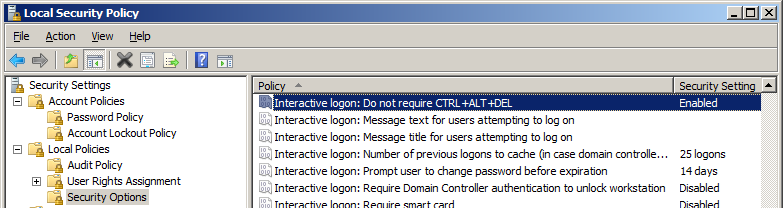
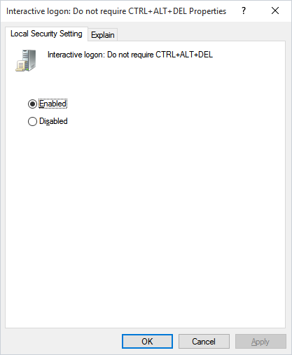

# Security Settings

**Windows 2008 and later security settings for Credential Provider**

Two security settings are required for foreground execution. These settings allow OpCon RPA to interact with the Windows Credential Provider, which is necessary for session management during task execution.

## 1. Do Not Require CTRL+ALT+DEL

To make interactive logon work in Windows 2008 and later, you must disable SAS (Secure Attention Sequence).

### Steps

1. Open **Administrative Tools** > **Local Security Policy**
2. Navigate to **Local Policies** > **Security Options**
3. Find the policy **"Interactive logon: Do not require CTRL+ALT+DEL"**

4. Set it to **Enabled**

### Details

This security setting determines whether pressing CTRL+ALT+DEL is required before a user can log on.

- **Enabled:** A user is not required to press CTRL+ALT+DEL to log on. Not having to press CTRL+ALT+DEL leaves users susceptible to attacks that attempt to intercept the users' passwords. Requiring CTRL+ALT+DEL before users log on ensures that users are communicating by means of a trusted path when entering their passwords.
- **Disabled:** The user is required to press CTRL+ALT+DEL before logging on to Windows.

**Defaults:**
| Environment | Default |
|---|---|
| Domain-computers (Windows 8 and later) | Enabled |
| Domain-computers (Windows 7 or earlier) | Disabled |
| Stand-alone computers | Enabled |

## 2. User Account Control: Admin Approval Mode for the Built-in Administrator Account

To communicate with the Credential Provider, you need to **disable** this setting.

:::warning
After applying this setting, a reboot of the computer is required.
:::

### Steps

1. Open **Administrative Tools** > **Local Security Policy**
2. Navigate to **Local Policies** > **Security Options**
3. Find the policy **"User Account Control: Use Admin Approval Mode for the built-in Administrator account"**
4. Set it to **Disabled**

### Details

This policy setting controls the behavior of Admin Approval Mode for the built-in Administrator account.

- **Enabled:** The built-in Administrator account uses Admin Approval Mode. By default, any operation that requires elevation of privilege will prompt the user to approve the operation.
- **Disabled (Default):** The built-in Administrator account runs all applications with full administrative privilege.
