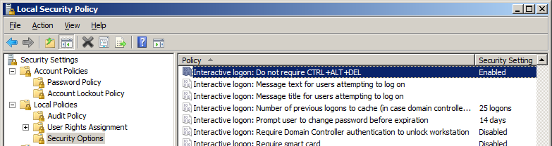
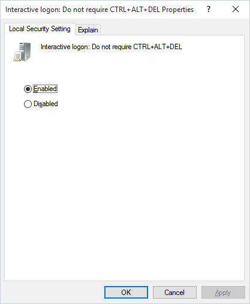
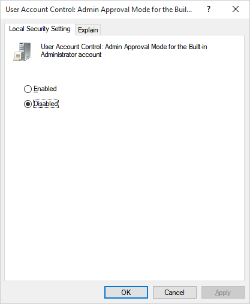

# Security Settings

## What is it?

This page describes two Windows local security policies required for OpCon RPA to interact with the Windows Credential Provider. These settings allow OpCon RPA to perform foreground task execution and session management on Windows 2008 and later.

**Windows 2008 and later security settings for Credential Provider**

Two security settings are required for foreground execution. These settings allow OpCon RPA to interact with the Windows Credential Provider, which is necessary for session management when a task runs.

The RPA Agent installer registers its own credential provider for this purpose: it installs `InteractiveLogonCPx64.dll` to `C:\Windows\System32` and registers it under `HKEY_LOCAL_MACHINE` as a COM server and as a Windows credential provider, so the Windows sign-in interface loads it. The RPA Agent service, running as Local System, uses it to unlock and switch desktop sessions when no one is at the machine. The two policies below are what allow that exchange to complete. See [Service Accounts and Permissions](./rpa-permissions.md).

:::note One-time administrator task
Applying these policies requires local administrator rights on the RPA host. This is a one-time setup step. The accounts that run robot tasks do not need local administrator rights. See [Service Accounts and Permissions](./rpa-permissions.md).
:::

## 1. Do not require CTRL+ALT+DEL

To make interactive logon work in Windows 2008 and later, you must disable SAS (Secure Attention Sequence).

### Steps

To disable SAS, complete the following steps:

1. Open **Administrative Tools** > **Local Security Policy**.
2. Go to **Local Policies** > **Security Options**.
3. Find the policy **Interactive logon: Do not require CTRL+ALT+DEL**.

   

4. Set it to **Enabled**.

   

### Details

This security setting determines whether pressing CTRL+ALT+DEL is required before a user can log on.

- **Enabled:** A user is not required to press CTRL+ALT+DEL to log on. Not having to press CTRL+ALT+DEL leaves users susceptible to attacks that attempt to intercept users' passwords. Requiring CTRL+ALT+DEL before users log on ensures that users are communicating by means of a trusted path when entering their passwords.
- **Disabled:** The user is required to press CTRL+ALT+DEL before logging on to Windows.

**Defaults:**

| Environment | Default |
|---|---|
| Domain-computers (Windows 8 and later) | Enabled |
| Domain-computers (Windows 7 or earlier) | Disabled |
| Stand-alone computers | Enabled |

## 2. User Account Control: Admin Approval Mode for the Built-in Administrator Account

To communicate with the Credential Provider, **disable** this setting.

:::warning
After applying this setting, the computer must be rebooted.
:::

### Steps

To disable Admin Approval Mode for the built-in Administrator account, complete the following steps:

1. Open **Administrative Tools** > **Local Security Policy**.
2. Go to **Local Policies** > **Security Options**.
3. Find the policy **User Account Control: Use Admin Approval Mode for the built-in Administrator account**.
4. Set it to **Disabled**.

### Details

This policy setting controls the behavior of Admin Approval Mode for the built-in Administrator account.

- **Enabled:** The built-in Administrator account uses Admin Approval Mode. By default, any operation that requires elevation of privilege prompts the user to approve the operation.
- **Disabled (Default):** The built-in Administrator account runs all applications with full administrative privilege.

## FAQs

**Why does OpCon RPA need these security settings?**
The settings allow OpCon RPA to interact with the Windows Credential Provider for session management during foreground task execution.

**Do I need to reboot after changing the Admin Approval Mode setting?**
Yes. After applying the Admin Approval Mode change, the computer must be rebooted.

**Which Windows versions do these settings apply to?**
Windows 2008 and later.

**Do I need to keep local administrator rights after applying these settings?**
No. Applying the policies is a one-time administrator task. Ongoing operation does not require local administrator rights. See [Service Accounts and Permissions](./rpa-permissions.md).

**Which OpCon RPA component uses the Credential Provider?**
The RPA Agent service, which runs under the Local System account. The Tray Client that runs the automation does not interact with the Credential Provider.

**Does OpCon RPA install its own credential provider?**
Yes. The RPA Agent installer installs `InteractiveLogonCPx64.dll` to `C:\Windows\System32` and registers it as a Windows credential provider, so the sign-in interface loads it. The RPA Agent service passes credentials to it over a named pipe on the local machine. Include it in the scope of any security review of the host. See [Service Accounts and Permissions](./rpa-permissions.md).

## Related topics

- [Service Accounts and Permissions](./rpa-permissions.md)
- [Robot Task](./robot-task-rpa.md)

## Glossary

| Term | Definition |
|------|-----------|
| Credential Provider | The Windows component that handles user credentials at logon. |
| SAS (Secure Attention Sequence) | The CTRL+ALT+DEL key combination Windows uses to start a trusted path for user authentication. |
| Admin Approval Mode | A User Account Control mode that requires the built-in Administrator account to approve elevated operations. |
