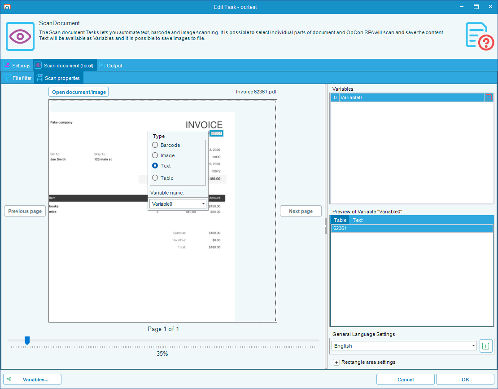
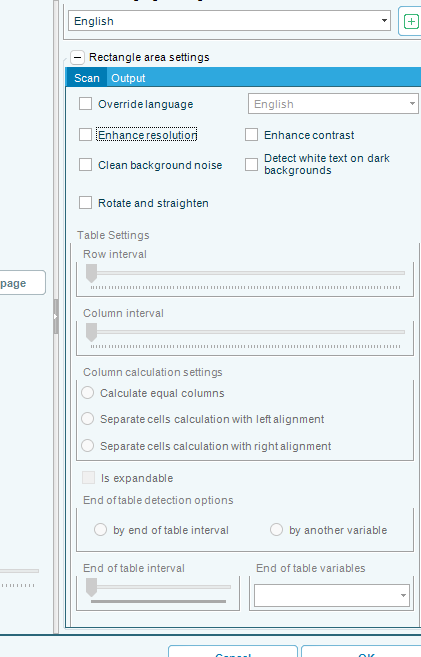
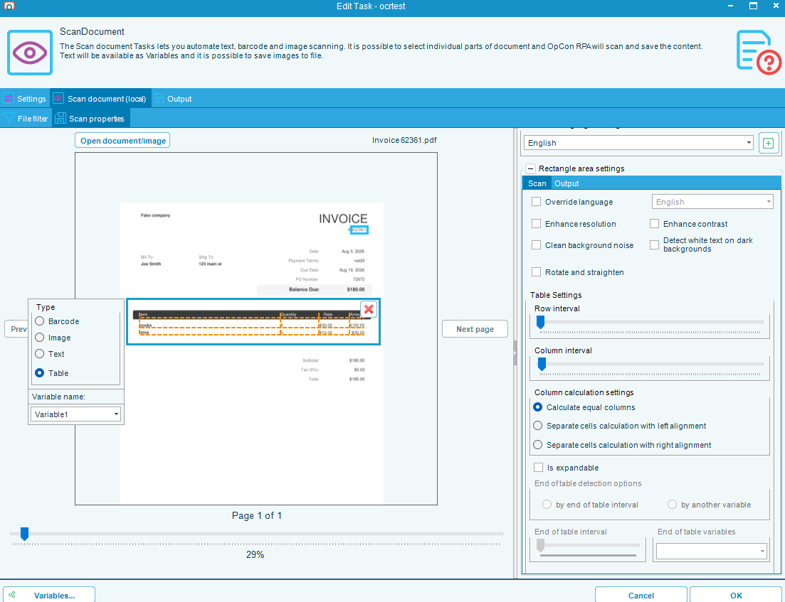

# Scan Models

## What is it?

A **scan model** is the set of regions you mark on a sample document. Each region becomes a named variable, and the task reads that same region out of every document it processes.

You build the model by opening one representative document and drawing a rectangle around each value you want.

:::tip Draw with the right mouse button
This is the step people get stuck on. You draw a region by holding the **right** mouse button and dragging. The left button pans the document instead, so a left-drag looks like the drawing tool is broken.
:::

## Mark a region

To mark a region on a document, complete the following steps:

1. Open the Scan Document task, select the **Scan document (local)** tab, then the **Scan properties** tab.
2. Select **Open document/image** and choose a document that represents the ones the task will process.
3. Hold the **right** mouse button and drag a rectangle around the value you want to read.
4. Release the right mouse button. The region is created and read immediately — it turns orange with a spinner while it is being read.
5. Repeat for each value you want.

Once you release the button, the region appears in the **Variables** list on the right and its result appears in the preview beneath. Neither updates while you are still dragging, so the list stays empty and the preview keeps showing the previously selected region until you let go.

:::caution A small drag is silently discarded
A region smaller than 10 pixels in either direction is thrown away without a message. If a right-drag appears to do nothing, you probably did not drag far enough — try again with a deliberate, larger rectangle.
:::

### Working with the document

| To do this | Do this |
|---|---|
| Draw a region | Hold the **right** mouse button and drag |
| Move the document in the window | Hold the **left** mouse button and drag an empty part of the page |
| Zoom | Hold **Ctrl** and use the mouse wheel, or use the zoom slider |
| Change page | Select **Previous page** or **Next page** |
| Select a region | Select it with the left mouse button |
| Move a region | Drag inside a selected region |
| Resize a region | Drag one of the eight handles around a selected region |
| Delete a region | Select the delete button at the top-right inside the region, or use **Delete** on its row in the **Variables** list |

Moving or resizing a region re-reads it, so the preview always matches what the region currently covers.

## Name each region

Every region is created with an automatic name — **`Variable0`**, **`Variable1`**, and so on, numbered in the order you drew them. That name is what the task publishes, so rename regions to something meaningful before you finish.

A region publishes a variable unless you change its destination. The **Output** tab beside **Scan** offers **Output to Task Variable** (the default), **Output to Job Variable**, or **Output to file** — and they are mutually exclusive, so choosing the file gives you no variable for that region. See [Scan Document](./scan-document-task.md#how-results-reach-your-automation).

Select a region and a small properties window appears beside it, with a **Variable name:** field and the region's **Type**. The figure under [Mark a region](#mark-a-region) shows one, alongside the same region in the **Variables** list.

To rename a region, complete the following steps:

1. Select the region.
2. In the **Variable name:** field, enter the name you want.
3. Select elsewhere on the page to deselect the region. The new name is applied at this point.

:::caution The name is applied when you deselect, not as you type
Typing in **Variable name:** does not commit the change. The name is saved when you deselect the region, so deselect before you close the task.

If another region already uses that name, the change is discarded and RPA reports "There is already a Variable with this name." The region keeps its previous name, so check the **Variables** list afterwards to confirm the rename took.
:::

The name field also offers `Country`, `Invoice`, `Company name`, and `Address` as suggestions. They are only starting points — any name works.

## Choose what a region reads

Each region has a **Type**, which decides what its variable contains.

| Type | The variable contains |
|---|---|
| **Text** | The text found in the region |
| **Table** | The region parsed into rows and columns, as delimited text |
| **Barcode** | The value of the first barcode found in the region |
| **Image** | The region itself as an image, rather than text read from it |

RPA sets the type for you the first time it reads a new region: a region containing a barcode becomes **Barcode**, a region with no readable text becomes **Image**, and anything else becomes **Text**.

:::note Table is never chosen automatically, and the type is locked until the first read finishes
**Table** is never selected for you — set it yourself for a region covering a table. The type options also stay unavailable until the region's first read completes, so wait for the spinner to clear before changing it.
:::

## Improve a region that reads badly

Select the region, then use the options on the **Scan** tab of **Rectangle area settings**. All are off by default, and the region is re-read as soon as you change one, so you can judge the effect in the preview.

| Option | Use when |
|---|---|
| **Enhance resolution** | The region is small or low-resolution |
| **Enhance contrast** | The text is faint against its background |
| **Clean background noise** | The document is a noisy scan or a fax |
| **Detect white text on dark backgrounds** | The region is light text on a dark block |
| **Rotate and straighten** | The page was scanned slightly askew |

Turn on only what a region needs. Each option costs processing time, and some make a clean region read worse.

**Override language** on the same tab reads that one region in a different language from the rest of the document — useful for a bilingual form. See [Scan Document](./scan-document-task.md#languages) for how languages are obtained.

## Regions on a table

Set a region's type to **Table** and the **Table Settings** group becomes available.

:::tip The region shows you how it split the table
Once a Table region has been read, RPA draws the row and column boundaries it detected as dashed lines across the region. That is your feedback loop: adjust **Row interval** and **Column interval** until those lines fall where the table's real rows and columns are, rather than guessing and checking the preview.
:::

| Setting | What it does |
|---|---|
| **Row interval** / **Column interval** | Sliders for how much vertical or horizontal space separates one row or column from the next. Adjust these when rows or columns are being merged or split incorrectly |
| **Calculate equal columns** | Under **Column calculation settings**. Treats the columns as evenly spaced. Selected by default, and correct for most tables |
| **Separate cells calculation with left alignment** / **with right alignment** | The other two choices under **Column calculation settings** — only one of the three can be selected. Use these when the table's columns are uneven and its content is consistently left- or right-aligned |
| **Is expandable** | The table can grow, so the region should extend past its drawn height to catch additional rows |

**End of table detection options** stays unavailable until **Is expandable** is selected. Once it is, tell RPA where the table stops:

- **by end of table interval** — stop after a set amount of blank vertical space, on the **End of table interval** slider.
- **by another variable** — stop when it reaches another region you have marked further down the page, such as a totals line. Choose that region under **End of table variables**, and use **Include** to decide whether the region marking the end is itself part of the table.

:::note A region used only to mark the end of a table produces no variable
If you mark a region purely to signal where a table ends, it publishes no value of its own — its whole job is to bound the table above it.
:::

## Multi-page documents

Regions belong to the page you drew them on, and only the current page's regions are shown. Move through the document with **Previous page** and **Next page**, marking regions on each page you need.

At run time each region is read from its own page number, so page 2's regions are read from page 2 of every document.

:::caution Every document needs the same page count
A region on page 3 fails if a document has only two pages, and the failure ends the task rather than skipping the region. Keep a batch consistent, and use the file filter to separate documents with different layouts into different tasks.
:::

## Check your work before saving

The **Variables** list shows every region with its name. Select a region to see what it currently reads in the preview area, which has a **Text** tab and a **Table** tab.

Work through the list and confirm each region reads what you expect, because a region that reads nothing produces an empty variable at run time rather than an error.

The task will not save in two cases:

- **"Scan model is not configured."** — no regions are marked. Mark at least one.
- **"Wait until all zones are scanned."** — a region is still being read. Wait for the spinner to clear.

## FAQs

**Why does dragging not draw anything?**
Use the **right** mouse button. The left button pans the document. If you are using the right button, check that the drag is at least 10 pixels in both directions — smaller regions are discarded silently.

**I renamed a region and the old name came back.**
Either the rename was not committed, or the name was already taken. The name is applied when you deselect the region, and a duplicate name is rejected with a message. Rename it and then select elsewhere on the page.

**Can two regions have the same name?**
No. Names must be unique within the task, because each one becomes a variable.

**Can I copy a scan model to another task?**
Not directly. Export and import the task, or copy the task and change its file filter. See [Copy a Task](./copy-task-rpa.md).

**Do I have to mark a region for the whole page?**
Only if you want the whole page's text. The task reads nothing outside the regions you mark.

**Can regions overlap?**
Yes. Each is read independently, so a region covering a whole table and separate regions for individual cells within it all work.

**Why is the Table option unavailable?**
The type options stay unavailable until a region's first read finishes. Wait for the spinner to clear.

**What happens if a document does not have the value where the region is?**
The region reads whatever is at that position — usually nothing, giving an empty variable. That is why documents in one task have to share a layout.

## Related topics

- [Scan Document](./scan-document-task.md)
- [Wildcard Matching](./rpa-wildcard-matching.md)
- [Task Types](./task-types-overview.md)

## Glossary

| Term | Definition |
|------|-----------|
| Scan model | The complete set of regions marked on a sample document, applied to every document the task processes. |
| Region | A rectangle marked on a page, published as a named variable. Also called a scan zone. |
| Region type | What a region reads: text, a table, a barcode, or an image. |
| Expandable table | A table region allowed to extend past its drawn height, so it captures rows added below. |
