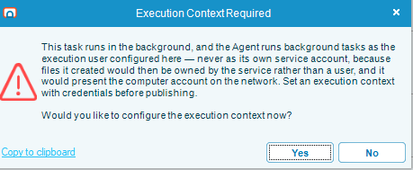

# Task Types

## What is it?

OpCon RPA has three task types. Which one you build determines what you can automate, whether the task needs a signed-in Windows session, and which activities are available to you.

| Task type | Automates | Needs a desktop session |
|---|---|---|
| [Robot Task](./robot-task-rpa.md) | The Windows desktop — any application, by driving its windows and controls | Yes |
| [Web Macro](./web-macro-task.md) | A process in a web browser, recorded against an embedded browser | No |
| [Scan Document](./scan-document-task.md) | Reading text, tables, and barcodes out of documents and images | No |

## Choosing a task type

Start from what the process touches.

- **It uses a Windows application** — a teller platform, a core banking client, an ERP front end, Excel, Outlook. Use a **Robot Task**. This is the only type that drives the Windows desktop.
- **It happens entirely in a browser** — a portal, a web form, a supplier site. Use a **Web Macro**. It runs against its own embedded browser rather than the user's, which is what lets it run with nobody signed in.
- **It reads values out of documents** — invoices, statements, scanned forms. Use a **Scan Document** task. You mark the regions to read once, and every document that matches the file filter is read the same way.

A process that spans more than one of these is built as more than one task, chained in an OpCon schedule. A Robot Task can also drive a browser window if you need the user's real browser rather than the embedded one, but a Web Macro is the better tool when the process is web-only.

:::note Only Robot Tasks need somebody signed in
A Robot Task drives an interactive desktop, so it needs a Windows session to run in — either one a person signed in to, or one OpCon creates over Remote Desktop. Web Macro and Scan Document tasks run in their own host process, with no interactive session at all. See [Unattended Session](./rpa-unattended-session.md).

They still need a Windows account to run *as*, though. A Web Macro or Scan Document task runs as its execution user, and a task with no execution user fails, whether or not anybody is signed in. Set an Execution Context on these tasks.

The task editor prompts you when the execution context is missing: the **Execution Context Required** window explains the requirement and asks whether to configure it now. Select **Yes** to open the configuration.

:::

## What every task type shares

| Concept | Applies to |
|---|---|
| **Execution Context** — the Windows account the task runs as | All three. Robot Tasks additionally control what happens to the session before and after the run |
| **Credentials** — the encrypted Windows credentials RPA uses to run as that account | All three |
| [Wildcard Matching](./rpa-wildcard-matching.md) — the `*`, `?`, and `#` patterns | Robot Task window titles and element text. In the file filters used by Scan Document and by file activities, **Folder** and **Include file mask** accept `*` and `?` only |
| Versioning, drafts, publishing, [copy](./copy-task-rpa.md) and [delete](./delete-task-rpa.md) | All three |
| [Import and export](./import-export-tasks-opcon-rpa.md) | All three |

## FAQs

**Can one task do both desktop and web automation?**
A Robot Task can drive a browser window on the desktop, so yes in that sense. But a Web Macro is more reliable for a web-only process, because it targets page elements directly rather than screen positions, and it does not need a desktop session.

**Which task types run without anyone signed in?**
Web Macro and Scan Document. They still need an account to run as — see the note above. A Robot Task needs a session as well as an account — see [Unattended Session](./rpa-unattended-session.md).

**Do all three support an execution user?**
Yes, though the form differs. A Robot Task's Execution Context also controls session behavior before and after the run; for Web Macro and Scan Document the window opens in a credentials-only mode, because there is no desktop session to lock or sign out.

**Can I convert a task from one type to another?**
No. The task type is fixed when you create the task. Build a new task of the type you need.

## Related topics

- [Robot Task](./robot-task-rpa.md)
- [Web Macro](./web-macro-task.md)
- [Scan Document](./scan-document-task.md)
- [Wildcard Matching](./rpa-wildcard-matching.md)
- [Unattended Session](./rpa-unattended-session.md)
