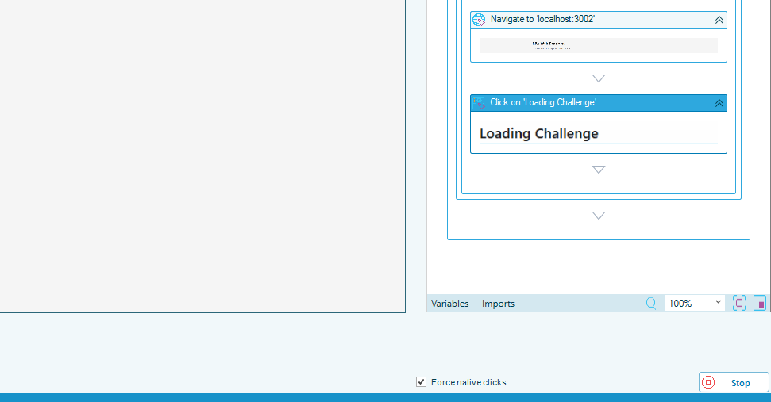
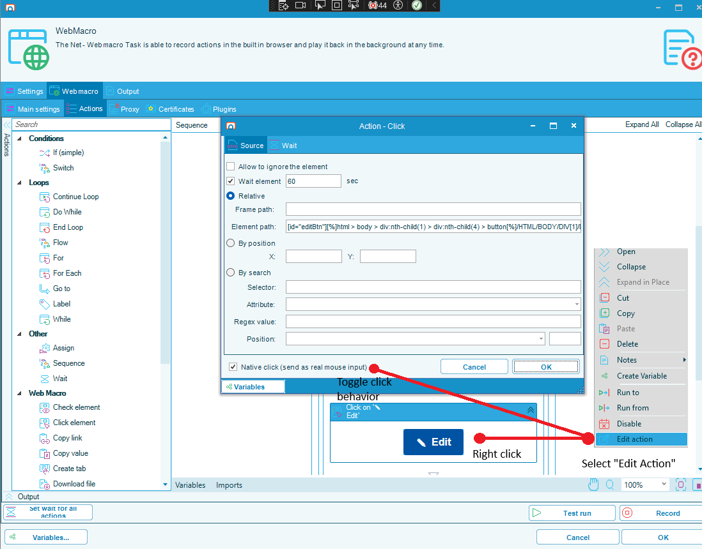

# Native Clicks in Web Macros

## What is it?

A web macro replays a recorded click in one of two ways:

- A **scripted click** tells the web page that the element was selected. It works on an element that is scrolled out of view or inside a frame, and it does not depend on where the element sits on screen.
- A **native click** moves the mouse to the element and sends a real mouse button press, exactly as a person would.

The difference matters because of how browsers treat the two. A scripted click runs the page's own handlers, but the browser marks the event as untrusted and refuses anything it only allows a real user to do. Opening a new tab or window is the clearest case: a link that targets a new window does nothing at all under a scripted click — silently, with the step still reporting success, so the rest of the recording replays against the wrong page. Some pages also ignore scripted events outright.

Starting in 1.2.0, the **Force native clicks** option in the web macro recorder controls whether every click you record is replayed as real mouse input.

:::note New tasks record native clicks by default
**Force native clicks** is on for a web macro task you create in 1.2.0 or later, so everything you record gets native clicks. A task saved before this option existed does not carry the setting and keeps replaying exactly as it was recorded.
:::

## When to use it

Leave **Force native clicks** on unless a recording misbehaves in the way described below. With it on, a click that needs real mouse input gets it without your having to identify it in advance — which matters because the recorder cannot always tell which clicks those are.

| Situation | Setting |
|---|---|
| Anything you are recording from scratch | **On** — the default |
| A button that opens a new window from its own code, so nothing about the element reveals it | **On** — this is the case nothing else catches |
| A page whose elements move, are covered by a banner or dialog, or sit inside a frame | **Off**, then set the individual clicks that need native input on their steps |
| An existing recording that already replays correctly | Leave it as it is |

Turning it off does not disable native clicks entirely. With it off, the recorder still flags any click it observes opening a new tab or window, because there is no other way to make that click work.

:::caution A native click has to be aimed
A native click is a real mouse press at a screen position, so playback has to know where the element is. It falls back to a scripted click, and records why in the task output, when it cannot aim reliably:

- the element is located **By search**, or sits inside a frame
- the element has no size on screen
- the element measures to a point outside the browser view, which means the page is still moving it

This is why leaving the option on is not risk-free on a page that shifts under playback: every click becomes dependent on the element's position at the moment it runs.
:::

## Record with native clicks

The **Force native clicks** option appears in the recorder once recording starts, and applies to the clicks you record from that point on. Because it can be changed mid-recording, one recording can mix the two: record the part of the process that needs scripted clicks with the option off, turn it on for the button that opens a window, then turn it off again.

To record a specific click as a native click, complete the following steps:

1. Open the web macro task and start recording.
2. Clear **Force native clicks** and record the process up to the point before the click that needs native input.
3. Select **Force native clicks**.
4. Perform the click in the recorded page.
5. Clear **Force native clicks** and record the rest of the process.
6. Stop recording and save the task.

The state you leave the option in is saved on the task and is preselected the next time you record it.

:::note Changing the option does not change recorded steps
It affects only clicks recorded after you change it. Clicks already in the sequence keep the setting they were recorded with — change those on their own steps.
:::

## Change a click after it is recorded

Each recorded click carries its own **Native click** setting, whichever state the option was in when you recorded it. You can change it on the step, which is the quickest fix when a single click is the problem — you do not have to record the process again.

To change whether a recorded click is a native click, complete the following steps:

1. Open the web macro task and select the **Web macro** tab.
2. In the sequence, right-click the click step you want to change and select **Edit action**. The **Action - Click** window is displayed.
3. Select the **Native click (send as real mouse input)** option to replay the click as real mouse input, or clear it to replay the click as a scripted click.
4. Select **OK**.
5. Save the task.

A step changed this way is indistinguishable from one recorded with **Force native clicks** on.

## FAQs

**What is the difference between a native click and a scripted click?**
A native click moves the mouse and sends a real button press. A scripted click tells the page the element was selected. Only a native click carries the user activation a browser requires before it will open a new tab or window.

**Why did my recorded click do nothing on playback?**
The most likely cause is a button that opens a new window from its own code. Nothing about the element on the page reveals that it will, so a recording made with **Force native clicks** off recorded it as an ordinary click. Set the click to a native click on its step, or record it again with the option on.

**Should I leave Force native clicks on?**
Yes for most recordings — it is the default for new tasks. Turn it off when the page moves elements under playback, covers them, or puts them in frames, since a native click depends on the element's position and falls back to a scripted click when it cannot be aimed.

**Does turning it off stop every native click?**
No. It stops the recorder from flagging clicks as it records them. Two things still produce a native click: a click the recorder observes opening a new tab or window is flagged regardless, and on playback a link that declares it opens a new window is recognized from the page itself. That second behavior is what lets recordings made before this option existed keep working.

**Is the setting stored on the task or on each step?**
Both. The option applies while you record and its state is saved on the task, and each recorded click also stores its own flag. That is why a click can be changed one at a time on its own step.

**Do I have to record the task again to change one click?**
No. Change the **Native click (send as real mouse input)** option on the step in the **Action - Click** window.

**How do I tell whether a click was replayed natively?**
The task output records it, naming the element and whether the click was sent as real mouse input or fell back to a scripted click, and why.

**Where do I set this for a Robot Task?**
Nowhere — this applies to web macro tasks. A Robot Task drives the Windows desktop and always uses real input.

## Related topics

- [Wildcard Matching](./rpa-wildcard-matching.md)
- [Robot Task](./robot-task-rpa.md)

## Glossary

| Term | Definition |
|------|-----------|
| Native click | A recorded click replayed by moving the mouse and sending a real mouse button press, which a browser treats as an action by a person. |
| Scripted click | A recorded click replayed by telling the web page that the element was selected. It does not carry user activation, so a browser will not open a new tab or window for it. |
| User activation | The browser's record that a real person acted on the page. Browsers require it before allowing actions such as opening a new window. |
| Web macro | An OpCon RPA task type that automates a process recorded against a web browser. |
